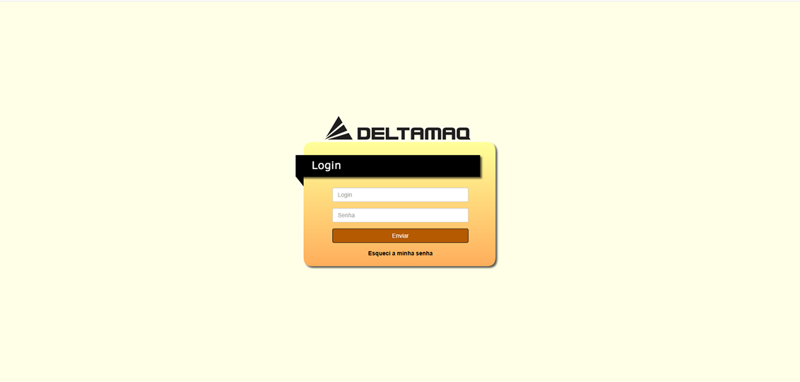
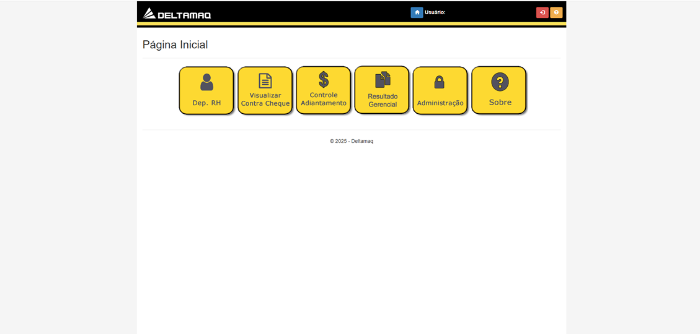
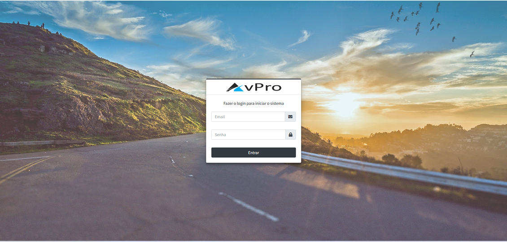
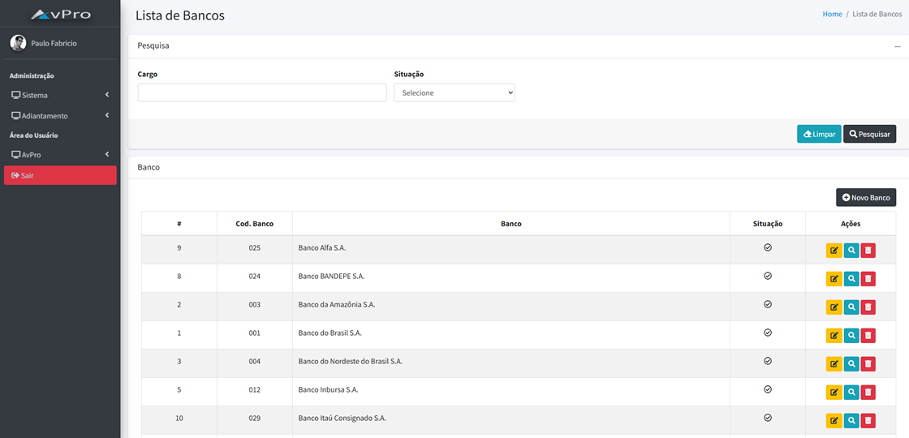

# 💼 Portfólio Profissional - Seu Nome

Bem-vindo ao meu portfólio! Aqui apresento alguns projetos profissionais e pessoais que desenvolvi ao longo da minha carreira em tecnologia.

---

## 👨‍💻 Sobre Mim
Sou desenvolvedor especializado em .NET, com experiência em arquitetura de software, integrações, APIs e sistemas corporativos.  
Atuo em projetos de alta criticidade, sempre prezando por qualidade, escalabilidade e boas práticas de desenvolvimento.

---

## 🚀 Projetos

### 📌 1. Intranet Deltamaq
**Descrição:**  
Desenvolvimento de um site interno para a empresa **Deltamaq**, com o objetivo de centralizar **políticas da empresa**, **notícias** e permitir que os colaboradores façam o **download de seus contracheques**.  

**Tecnologias:** .NET, ASP.NET MVC, Mysql  

📸 **Imagens:**  
  
  

---

### 📌 2. AvPro (Projeto Pessoal)
**Descrição:**  
Sistema web para **controle de pedidos de adiantamento de viagem**, com **níveis de autorização** e **prestação de contas**.  

**Tecnologias:** .NET 8, EF Core, Mysql, CQRS  

📸 **Imagens:**  
  
  

---

### 📌 3. Módulo de Portaria - Ophir Loyola
**Descrição:**  
Sistema para controlar **entrada e saída de pessoas**, com **impressão de etiquetas** de identificação.  

**Tecnologias:** .NET, ASP.Net MVC, Oracle  

📸 **Imagens:**  
🚫 *Não disponíveis por motivos contratuais*  

---

### 📌 4. Módulo de Internação - Ophir Loyola
**Descrição:**  
Controle completo de **leitos hospitalares**, incluindo:  
- Disponibilidade de leito  
- Manutenção e limpeza  
- Liberação em caso de **alta** ou **óbito**  

**Tecnologias:** .NET, ASP.Net MVC, Oracle   

📸 **Imagens:**  
🚫 *Não disponíveis por motivos contratuais*  

---

### 📌 5. Módulo de Exames 3D
**Descrição:**  
Sistema para exibir **exames 3D de diagnóstico médico** e permitir ao médico gerar **laudos em PDF**.  

**Tecnologias:** .NET, ASP.Net MVC, Oracle, Biblioteca de Renderização 3D  

📸 **Imagens:**  
🚫 *Não disponíveis por motivos contratuais*  

---

## 📫 Contato
- **LinkedIn:** [https://www.linkedin.com/in/paulo-fabricio-galrao/](https://www.linkedin.com/in/paulo-fabricio-galrao/)  
- **GitHub:** [https://github.com/pfabricio](https://github.com/pfabricio)  
- **E-mail:** [galrao@gmail.com](mailto:galrao@gmail.com)

---
✍️ Desenvolvido por [Paulo Fabricio de Souza Galrão]
